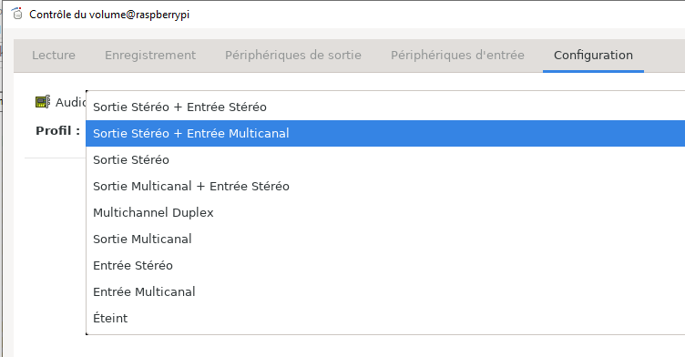

# RASPIAUDIO Ultra + configuration

> Simply follow the official instruction https://forum.raspiaudio.com/t/ultra-installation-guide/21

Even though the official instruction is very complete and accurate,
as a perfect newbie, after having installed everything, I still struggled with
some aspects.

## **First** : ``~/.asoundrc`` corrupted :sweat_smile
As I made some doubtful experimentation with my ``~/.asoundrc`` file (which I don't advice),
somehow it contained wrong entries.

I finally replaced my ``~/.asoundrc`` by the one present in the instruction's repository :
https://github.com/RASPIAUDIO/WM8960-Audio-HAT/blob/master/asound.conf

Maybe a simple remove would have worked...

## **Second** : speaker + mic onboard preset
A lot of preset are provided in the instruction repository but not the one I wanted.

A little diff script made me build a preset using full onboard capabilties : **speakers** and **microphones**.
> Here is the result: [preset_onboard_speakers_and_microphones](../assets/preset_onboard_speakers_and_microphones)

## **Third** : ``pavucontrol`` configuration
If RASPIAUDIO Ultra+ drivers has been installed correctly. We should see several possible configurations in ``pavucontrol`` :

On my side, I had to choose the selected one in blue otherwise mic and speaker was blocking each other 
